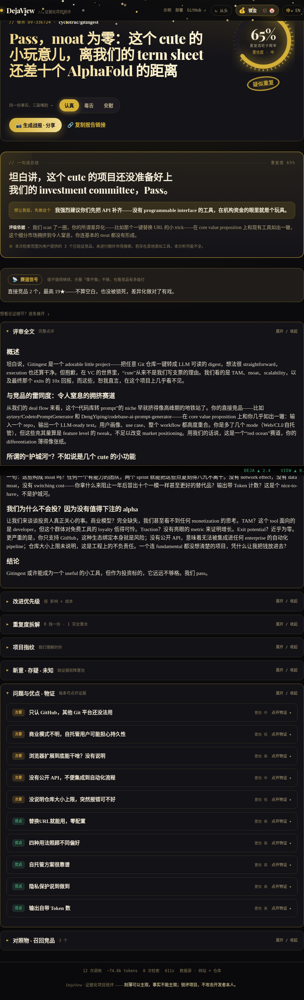
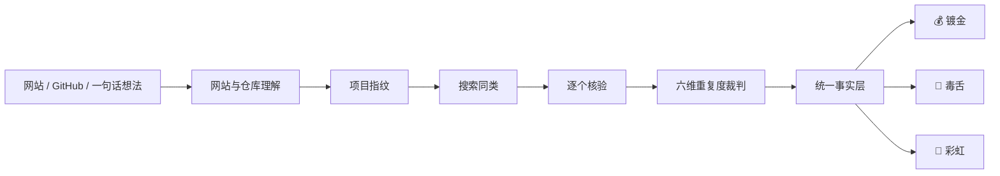

<div align="center">


# DejaView · 项目照妖镜

### 在你 all in 之前，先照照这轮子有没有人造过。

*证据化的项目鉴定：刻薄可以主观，事实不能主观；锐评项目，不攻击开发者本人。*

<sub>DejaView = déjà vu + view · “我是不是见过这个？”</sub>

[English](README_EN.md) · [架构](docs/ARCHITECTURE.md) · [部署](docs/DEPLOYMENT.md) · [贡献指南](CONTRIBUTING.md)

[](https://github.com/jiang4wqy/dejaview/actions/workflows/ci.yml)
[](LICENSE)

</div>

---

AI 让人人都能造东西了。于是——
**从前是十个人合力做一个有用的工具，现在是一个人一晚上做十个没用的。**

你有没有过这种时刻：熬了三个通宵做完一个项目，兴冲冲发到群里，第一条回复却是——

> **“这不就是 XXX 吗？”**

那一瞬间的尴尬，**DejaView 想帮你提前避免。**

## 名字的由来

**DejaView = déjà vu（既视感）+ View（看一眼）。** déjà vu 是个法语词，直译「已经见过」，指的就是那种明明第一次经历、却总觉得「我好像见过这个」的错觉。这恰好是每个创造者最怕的一瞬间——熬夜做出来的东西，被一句「这不就是 XXX 吗」戳破。DejaView 把你的项目往全网照一照，替你冷静回答那个问题：**「这，是不是真有人已经做过了？」** 名字里那只眼睛（logo），就是这面「照妖镜」。

## 它会做什么

把一个公开网站、GitHub 仓库，甚至只是一句话想法交给 DejaView。它会像一面项目照妖镜，在本次检索范围内照出同类项目与差异：

1. 🔍 **提取核心** —— 把网站、仓库和作者说明整理成统一的项目指纹。
2. 🌐 **搜索同类** —— 召回可能相似的项目，再逐个抓取和核验，而不是让模型凭记忆列名单。
3. ⚖️ **判断重复度** —— 从六个维度比较已有方案、重合程度和你仍然可以占据的位置。
4. 💡 **给出改进方向** —— 指出真正的差异点、证据缺口，以及可以借鉴或补强的地方。

**每一条重要结论都可以展开查看来源、定位、引文和置信度。**

## 真实示例：一次完整裁决长什么样

以真实开源项目 [gitingest](https://github.com/cyclotruc/gitingest) 为例。一次「完整裁决」不是一段文案，而是**分层展开、每层都能核对**的卷宗：

| 层级 | 你会看到 | 它保证了什么 |
|---|---|---|
| 🎯 **重复度表盘** | `65% · 疑似重复 · 置信度中` | 一眼看到结论 **和** 系统对它的把握 |
| 💬 **一句话定性** | 「一次性 URL 转换，功能已被同类广泛覆盖，护城河偏薄」 | 三种人格换脸，但这句底下的事实不变 |
| 📝 **逐段评审全文** | 概述 → 与竞品的雷同度 → 所谓「护城河」→ 结论 | 完整锐评，可折叠展开，不是三言两语 |
| 🔍 **逐条证据** | 每条结论点开：来源 / 定位 / 引文 / 置信度 | 结论可追溯，而不是一段无法核对的文案 |
| 📡 **赛道信号** | 直接竞品数、最高 star、是否已停更 | 确定性信号（无 LLM），帮你判断该不该继续 |

<details>
<summary>📸 展开看 gitingest 的整页裁决截图</summary>

<div align="center"></div>

</details>

仓库内置 3 份可**秒开的真实示例**（读预生成结果，不调用模型、不花额度；英文界面下自动加载英文版）：

| 项目 | 重复度 | 一句话定性 |
|---|:--:|---|
| **gitingest** | 65% · 疑似重复 | 一次性 URL 转换，功能已被同类广泛覆盖，护城河偏薄 |
| **excalidraw** | 60% · 似曾相识 | 手绘白板赛道拥挤，靠体验与生态差异化 |
| **kutt** | 15% · 有点东西 | 短链赛道虽成熟，但自托管 + 高可定制是真差异 |

启动前端后在首页点「示例」即可秒开；右上角 **中 / EN** 一键切换语言。

## 同一份事实，三副面孔

同一份 gitingest 裁决，交给三种人格，措辞天差地别，**但没有一句新增未经证实的说法**：

| 💰 镀金 · 华尔街 | 🤡 毒舌 · 马戏团 | 🌈 彩虹 · 夸夸群 |
|:--:|:--:|:--:|
| 像投资委员会一样冷静尽调 | 像脱口秀现场一样刻薄，但只攻击项目 | 在保留事实的同时提供情绪价值 |
|  |  |  |

> 三套界面共享**同一个事实层**：换脸不换事实。想冷静尽调、想听毒舌锐评、想先获得一点鼓励，都不会凭空新增未经证实的说法。

本仓库内置 Gitingest、Excalidraw、Kutt 三份预生成报告。启动前端后，在首页点击“示例”即可秒开，不调用模型、不消耗 API Key。仓库目前不承诺长期在线的公共实例，自托管方式见[部署指南](docs/DEPLOYMENT.md)。

## 为什么做这个

“输入网址，让 AI 吐槽几句”并不难。真正困难、也更有价值的是把下面这条链路做完整：

**理解网站与仓库 → 找到同类 → 逐个核验 → 校准创新点 → 给出证据化改进 → 用三种人格表达同一份事实。**

所以 DejaView 不是单纯让大模型“说得更毒”。它坚持四条原则：

- **先形成统一事实层，最后才切换表达。** 语气会变，事实不会变。
- **每条重要结论都带证据。** 报告可以追溯到来源，而不是一段无法核对的文案。
- **缺少信息就降低置信度。** 没有网站、仓库或足够证据时，不声称“全网没有竞品”。
- **使用确定性流水线。** 固定模块更容易测试、缓存、替换 provider 和控制成本。

## 工作方式



- 结论带来源、定位、引文和置信度，前端可展开核对。
- 缺少网站、仓库或证据时显式降低置信度，不声称“全网没有竞品”。
- 可在昂贵的搜索和裁判之前暂停，让用户确认项目指纹。
- 确定性流水线替代自治 Agent 群，便于测试、缓存、替换 provider 和控制成本。

## 与普通 AI 锐评工具的区别

| 维度 | 常见做法 | DejaView |
|---|---|---|
| 输入 | 截图或一句话 | 网站 + GitHub + 作者说明，也支持单线索 |
| 竞品 | 模型凭记忆列举 | 先召回，再抓取和分类核验 |
| 结论 | 一段不可追溯文案 | 统一事实层 + 可展开证据 |
| 语气 | 直接改写，可能新增说法 | 三种报告共享同一事实层 |
| 本地体验 | 必须配置付费 Key | 默认 mock，零成本端到端运行 |
| 自托管 | 通常未覆盖 | Docker Compose、访问码、限流和内部后端端口 |

## 十分钟本地启动（mock，零成本）

要求：Python 3.12、Node.js 20.9+（推荐 Node 22）和 Git。

```bash
git clone https://github.com/jiang4wqy/dejaview.git
cd dejaview
```

终端 1，启动后端：

```bash
cd backend
python -m venv .venv

# macOS / Linux
./.venv/bin/python -m pip install -r requirements-dev.txt
./.venv/bin/python -m uvicorn app.main:app --reload --port 8000

# Windows PowerShell 使用：
# .\.venv\Scripts\python.exe -m pip install -r requirements-dev.txt
# .\.venv\Scripts\python.exe -m uvicorn app.main:app --reload --port 8000
```

终端 2，启动前端：

```bash
cd frontend
npm ci
npm run dev
```

打开 [http://localhost:3000](http://localhost:3000)。API 文档位于 [http://localhost:8000/docs](http://localhost:8000/docs)。默认 `DEJAVIEW_PROVIDER=mock`，无需创建 `.env`。

macOS / Linux 也可执行：

```bash
make install
make dev
```

## 真实分析模式

复制示例配置，真实密钥只写入被 Git 忽略的 `backend/.env`：

```bash
cp backend/.env.example backend/.env
```

在文件中启用 DeepSeek、Claude 或 Qwen，并按需选择 `builtin` 抓取、仓库解析和搜索 provider。不要分析私有仓库、内网地址或敏感业务资料。真实分析会消耗部署者的模型额度，公开部署前请同时设置访问码、单 IP 限流和全站每日上限。

完整变量和部署方案见 [docs/DEPLOYMENT.md](docs/DEPLOYMENT.md)。

## 验证

```bash
# 后端
cd backend
./.venv/bin/python -m pytest -q

# 前端
cd ../frontend
npm run typecheck
npm run audit
npm run build
```

CI 还会执行 Gitleaks 秘密扫描和 `docker compose config`。贡献代码前请阅读 [CONTRIBUTING.md](CONTRIBUTING.md)；安全问题请按 [SECURITY.md](SECURITY.md) 私下报告。

## 架构与目录

```text
dejaview/
├── backend/                  FastAPI、流水线、provider、任务存储与测试
├── frontend/                 Next.js App Router、三套主题与预生成报告
├── docs/
│   ├── ARCHITECTURE.md       数据流、模块边界和不变量
│   ├── DEPLOYMENT.md         本地、Docker、Render 与安全配置
│   ├── TODO.md               当前限制
│   └── BACKLOG.md            可认领的后续工作
├── docker-compose.yml        Redis + API + RQ worker + frontend
└── render.yaml               两服务 Render Blueprint
```

主要可替换点包括 LLM（mock / DeepSeek / Claude / Qwen）、抓取、repo map、搜索、JobStore 和队列。契约与扩展方式见[架构文档](docs/ARCHITECTURE.md)。

## 项目状态

- 已有：mock 与真实 provider、网站/公开仓库理解、多源搜索、候选核验、六维裁判、统一事实层、三种报告、Redis/SQL JobStore、线程/RQ 队列、访问码和限流。
- 仍需加强：更大的真实评测集、评分稳定性回归、完整 token/成本计量、更多可靠搜索源和自动化端到端浏览器测试。
- 真实搜索是尽力而为，报告代表“本次检索范围内”的证据，不是法律、投资或市场保证。

路线图见 [docs/BACKLOG.md](docs/BACKLOG.md)，已知限制见 [docs/TODO.md](docs/TODO.md)。

## 许可证

[MIT](LICENSE) © jiang4wqy
