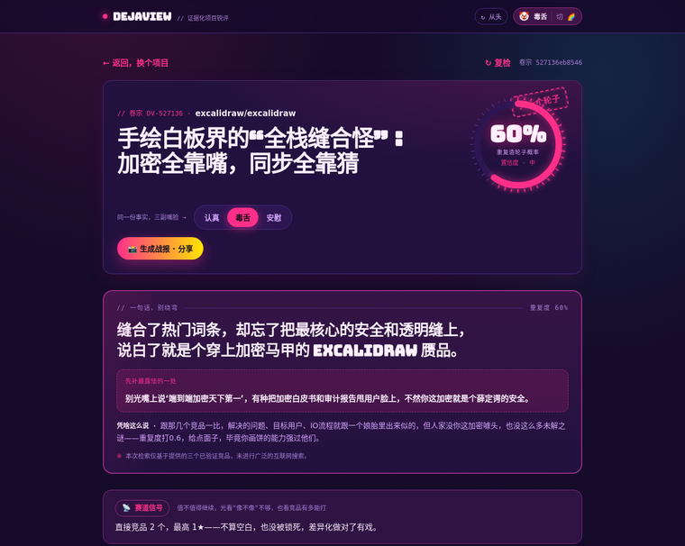
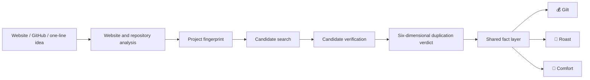

<div align="center">


# DejaView · Evidence-based project critique

**Before you go all in, check whether someone has already built that wheel.**

[中文](README.md) · [Architecture](docs/ARCHITECTURE.md) · [Deployment](docs/DEPLOYMENT.md) · [Contributing](CONTRIBUTING.md)

[](https://github.com/jiang4wqy/dejaview/actions/workflows/ci.yml)
[](LICENSE)

</div>

Give DejaView a public website, a GitHub repository, or a one-line idea. It extracts a project fingerprint, searches for and verifies comparable projects, scores duplication across six dimensions, and produces evidence-backed improvements.

This is more than an LLM writing a harsher paragraph. DejaView builds one shared fact layer first and changes presentation last: **the tone changes; the facts do not.**

## See it first

| 💰 Gilt · Wall Street | 🤡 Roast · Circus | 🌈 Comfort · Cheer Squad |
|:--:|:--:|:--:|
| Calm diligence and valuation | Sharp, but aimed only at the project | Pure emotional encouragement |
|  |  |  |

The repository ships with pre-generated reports for Gitingest, Excalidraw, and Kutt. Start the frontend and open a demo from the homepage—no model call or API key required. A permanent hosted instance is not currently promised; see the [self-hosting guide](docs/DEPLOYMENT.md).

## How it works



- Findings carry source, locator, quote, and confidence data that the UI can reveal.
- Missing inputs or evidence lower confidence; the system never claims that no competitor exists everywhere.
- An optional checkpoint lets the user confirm the fingerprint before expensive search and judgment stages.
- A deterministic pipeline keeps tests, caching, provider replacement, and cost control tractable.

## Why it is different

| Dimension | Typical critique tool | DejaView |
|---|---|---|
| Input | Screenshot or short prompt | Website + GitHub + author context, with single-clue fallback |
| Competitors | Recalled from model memory | Recalled, fetched, then classified and verified |
| Output | One opaque paragraph | Shared fact layer with expandable evidence |
| Tone | Rewriting may introduce claims | All three reports share the same facts |
| Local trial | Paid key required | End-to-end mock mode by default |
| Self-hosting | Often unspecified | Compose, access code, rate limits, internal API port |

## Ten-minute local start (free mock mode)

Requirements: Python 3.12, Node.js 20.9+ (Node 22 recommended), and Git.

```bash
git clone https://github.com/jiang4wqy/dejaview.git
cd dejaview
```

Terminal 1—backend:

```bash
cd backend
python -m venv .venv

# macOS / Linux
./.venv/bin/python -m pip install -r requirements-dev.txt
./.venv/bin/python -m uvicorn app.main:app --reload --port 8000

# Windows PowerShell:
# .\.venv\Scripts\python.exe -m pip install -r requirements-dev.txt
# .\.venv\Scripts\python.exe -m uvicorn app.main:app --reload --port 8000
```

Terminal 2—frontend:

```bash
cd frontend
npm ci
npm run dev
```

Open [http://localhost:3000](http://localhost:3000); API docs are at [http://localhost:8000/docs](http://localhost:8000/docs). The default provider is `mock`, so no `.env` file or key is required.

On macOS/Linux you may instead run `make install` followed by `make dev`.

## Real analysis

```bash
cp backend/.env.example backend/.env
```

Enable DeepSeek, Claude, or Qwen in that ignored file, then select the built-in crawler, repository mapper, and search providers as needed. Never submit private repositories, intranet URLs, or sensitive business material. Real mode spends the deployer's model quota; public deployments should use an access code, per-IP limits, and a global daily cap.

See [docs/DEPLOYMENT.md](docs/DEPLOYMENT.md) for all variables and deployment paths.

## Verification

```bash
cd backend
./.venv/bin/python -m pytest -q

cd ../frontend
npm run typecheck
npm run audit
npm run build
```

CI also runs Gitleaks and validates the Compose configuration. Read [CONTRIBUTING.md](CONTRIBUTING.md) before opening a PR and use [SECURITY.md](SECURITY.md) for private vulnerability reports.

## Architecture and repository layout

```text
dejaview/
├── backend/                  FastAPI, pipeline, providers, job stores, tests
├── frontend/                 Next.js App Router, three themes, static demos
├── docs/                     Architecture, deployment, limitations, backlog
├── docker-compose.yml        Redis + API + RQ worker + frontend
└── render.yaml               Two-service Render Blueprint
```

Replaceable boundaries include the LLM, crawler, repository mapper, search source, JobStore, and queue. See [the architecture guide](docs/ARCHITECTURE.md) for contracts and invariants.

## Project status

- Available: mock and real providers, public website/repository understanding, multi-source search, candidate verification, six-dimensional judgment, a shared fact layer, three reports, Redis/SQL stores, thread/RQ queues, access code, and rate limiting.
- Still needed: a larger real-world evaluation set, scoring stability regression, complete token/cost metering, more reliable search sources, and automated end-to-end browser tests.
- Search is best effort. A report describes evidence found within that run; it is not legal, investment, or market advice.

See [BACKLOG.md](docs/BACKLOG.md) and [TODO.md](docs/TODO.md) for the current roadmap and limitations.

## License

[MIT](LICENSE) © jiang4wqy
