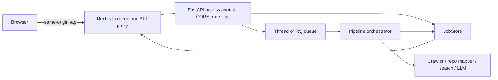
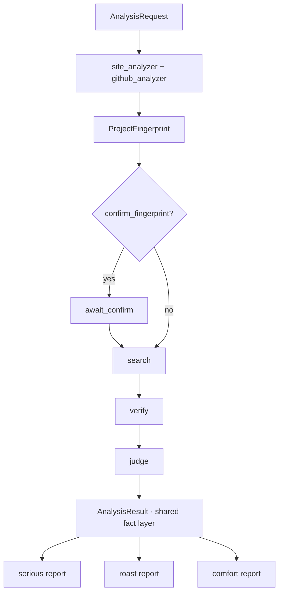

# DejaView Architecture

[中文 README](../README.md) · [English README](../README_EN.md) · [Deployment](DEPLOYMENT.md)

DejaView is a deterministic analysis pipeline around replaceable external capabilities. The design favors explicit data contracts, observable stages, and one shared fact layer over a group of autonomous agents.

## System flow



The browser polls the job endpoint. Docker exposes only the frontend on port `3000`; the Next.js runtime proxy reaches the API through the container network.

## Analysis pipeline



Website and repository analysis may run concurrently. Candidate verification and report rendering also use bounded concurrency. The orchestrator records progress, per-stage duration, degradations, and terminal errors on the `Job`.

## Layers and ownership

| Layer | Primary files | Responsibility |
|---|---|---|
| HTTP boundary | `backend/app/main.py`, `security.py`, `ratelimit.py` | Public endpoints, shared access code, CORS, trusted proxies, request limits |
| Jobs and execution | `jobs.py`, `queue.py` | Memory/Redis/SQL stores and thread/RQ execution |
| Orchestration | `pipeline/orchestrator.py` | Stage order, progress, checkpoint, degradation, completion |
| Analysis stages | `pipeline/*.py` | Fixed input/output transformations |
| External capabilities | `providers/*.py`, `services.py` | LLM, crawl, repository mapping, search and dependency injection |
| Contracts | `models/schemas.py` | Pydantic request, fact, verdict, report and job schemas |
| Presentation | `frontend/app`, `components`, `styles` | Flow, polling, evidence UI, themes and static demos |

## Shared fact-layer invariants

These rules are architectural constraints, not just prompt instructions:

1. `factlayer` creates strengths, issues, improvements, evidence and the duplication verdict before any tone-specific report is rendered.
2. Every tone-specific report receives the same `AnalysisResult`.
3. `pipeline/report.py` replaces generated findings with findings from the shared fact layer, so a tone cannot introduce a new factual accusation.
4. `search_scope_note` limits claims to the sources and time covered by the current run.
5. Missing evidence lowers confidence or appears as an unknown; it must not become an invented certainty.

Tests in `backend/tests/` protect the shared-fact and tone invariants. Any schema or scoring change should include an explicit migration and regression plan.

## Replaceable capabilities

`build_services(settings)` constructs a `Services` container. Pipeline stages consume the interface they need and do not instantiate providers directly.

| Capability | Local default | Other implementations present |
|---|---|---|
| LLM | `mock` | Claude, DeepSeek and Qwen-compatible endpoints |
| Crawler | `stub` | built-in HTTP crawler, browser crawler, Firecrawl |
| Repository mapper | `stub` | built-in shallow clone mapper; optional integrations |
| Search | `mock` | GitHub, V2EX, Juejin, composite; optional integrations |
| JobStore | in-memory | Redis and SQL (SQLite/Postgres) |
| Queue | background thread | RQ worker with Redis |
| Cache | disabled by default | local JSON cache |

To add a provider, implement the existing interface, register it in the corresponding `make_*` function, and add contract tests. Pipeline stages should not need modification.

## Failure behavior

- Site and repository analysis are degradable: a provider failure records a degradation and continues with empty facts.
- Fingerprint, search, judgment, fact-layer, and report failures are terminal because later stages cannot produce a trustworthy result.
- Remote provider calls use bounded retry behavior where implemented.
- Polling keeps an existing job on transient network failures; 403 and 404 errors stop automatic retry and show an actionable message.
- The global daily limit remains a cost backstop even when per-IP attribution is unavailable behind a proxy.

## HTTP and job lifecycle

Public endpoints:

- `GET /api/health`
- `POST /api/access`

Endpoints protected when `DEJAVIEW_ACCESS_CODE` is set:

- `POST /api/analyze`
- `GET /api/jobs`
- `GET /api/jobs/{id}`
- `POST /api/jobs/{id}/confirm`
- `GET /api/jobs/{id}/report`

Typical job states:

```text
queued → running → await_confirm → running → done
                 ↘ error        ↗
```

The access code is a shared deployment gate, not an account or authorization system. Do not use it as tenant isolation.

## Frontend boundaries

- `app/page.tsx` coordinates intro → persona → project form.
- `components/ProjectForm.tsx` owns input, validation and submission.
- `components/DemoPicker.tsx` owns pre-generated report entry points.
- `lib/showcase-data.ts` owns showcase copy and example metadata.
- `app/report/[jobId]/page.tsx` owns polling and terminal states.
- `components/ReportView.tsx` renders a completed job without changing facts.
- `styles/*.css` separates base, intro, worlds, form, report and responsive rules.

## Security and data boundary

Real model keys stay in backend environment variables. The browser only stores the optional shared access code and sends it through `X-Access-Code`; it never receives the model key. Trusted proxy ranges are empty by default, so untrusted clients cannot spoof `X-Forwarded-For` to bypass per-IP limits.

The application analyzes public material. Private repositories, intranet URLs and sensitive business content are outside the supported boundary. See [SECURITY.md](../SECURITY.md) and [Deployment](DEPLOYMENT.md).
