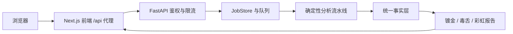

# DejaView 开源展示强化设计

日期：2026-08-08

状态：已获用户确认，等待规格复核

目标分支：`codex/open-source-showcase`

## 1. 背景

DejaView 已具备可运行的 FastAPI 流水线、Next.js 前端、三种报告语气、预生成示例和 Docker/Render 部署配置。当前仓库的主要问题不是核心能力缺失，而是开源入口、默认安全性、前端可读性和持续验证不足：

- README 信息丰富但重点分散，缺少英文入口、许可证和贡献规范；
- 预生成演示数据含一条已过期的第三方 S3 签名 URL，`Fredoka.ttf` 实际为 GitHub 404 HTML；
- Next.js 版本存在已知高危漏洞，Python 运行与开发依赖混在一起且未锁定；
- Docker Compose 对外映射后端 `8000`，任务读取接口未统一要求访问码；
- 首页组件和全局样式文件过大，人物文案、示例数据和表单逻辑混在页面入口中；
- GitHub Secret Scanning、Dependabot 和 Code Scanning 未启用，仓库缺少自动化安全基线。

本设计将项目包装为同时面向作品集访客、潜在贡献者和自托管用户的开源展示项目。保留“镀金 / 毒舌 / 彩虹”三种强烈视觉，不重写分析流水线，不增加账户、支付或管理后台。

## 2. 成功标准

1. 新访客在 README 或首页首屏即可理解项目价值、事实层不变量和三种语气的关系。
2. 用户最多两次点击即可打开预生成示例报告，默认 mock 模式无需 API Key。
3. 新贡献者可按文档完成安装、测试、构建和首次 Pull Request。
4. 仓库当前树不存在有效秘密或第三方凭据痕迹；Git 历史不存在未复核的秘密命中，已过期的单一历史命中使用精确规则记录；公开资源不含错误字体文件。
5. 前端依赖审计不含 critical/high 漏洞，生产构建通过。
6. Docker 默认只向主机映射前端 `3000`；启用访问码时，匿名用户不能读取任务或报告。
7. 后端测试、前端类型检查与构建、依赖审计、Docker 配置检查和秘密扫描在 CI 中自动执行。
8. 三种主题、事实层共享、现有 API 请求结构和 mock 演示保持兼容。

## 3. 非目标

- 不重构 `backend/app/pipeline/` 的七阶段流水线。
- 不改变事实层和报告层的数据契约。
- 不引入账户、支付、团队空间、管理后台或新的数据库产品功能。
- 不采用大型 UI 组件库或重新生成品牌图片。
- 不承诺未经测量的性能、覆盖率或“生产就绪”状态。
- 不清理与本次目标无关的历史代码或格式。

## 4. 仓库与文档设计

### 4.1 开源入口

重写 `README.md` 为中文主入口，并新增结构一致的 `README_EN.md`。两者顶部互相链接，按以下顺序组织：

1. 一句话定位、主视觉和语言切换；
2. 在线演示 / 预生成示例 / 本地运行三个入口；
3. “网站 + GitHub → 搜索 → 验证 → 裁判 → 事实层 → 三种语气”工作流；
4. 与普通 AI 毒舌点评工具的差异；
5. 十分钟 mock 快速启动；
6. 真实模式、成本与密钥说明；
7. 架构、目录和可替换 provider；
8. 测试状态、路线图、贡献和许可证。

部署细节移到 `docs/DEPLOYMENT.md`，README 只保留最短可运行路径和链接。`docs/ARCHITECTURE.md` 使用 Mermaid 展示请求、队列、流水线、事实层和报告的数据流，并明确不可破坏的不变量。`docs/TODO.md` 与 `docs/BACKLOG.md` 只保留真实未完成项。

### 4.2 开源协作文件

新增：

- `LICENSE`：MIT License，版权人为 `jiang4wqy`；
- `CONTRIBUTING.md`：开发环境、分支、提交、测试和 PR 要求；
- `SECURITY.md`：秘密处理、私下报告方式、公开部署成本与数据边界；
- `.github/ISSUE_TEMPLATE/bug_report.yml`；
- `.github/ISSUE_TEMPLATE/feature_request.yml`；
- `.github/pull_request_template.md`；
- `.github/dependabot.yml`；
- `.github/workflows/ci.yml`。

不添加 CODEOWNERS、治理委员会或版本发布自动化，因为当前项目仍由单一维护者主导。

### 4.3 仓库卫生

保留现有 `.gitignore`，仅补充证书、覆盖率、构建缓存和临时审计文件规则。清理 `frontend/public/demos/*.json` 中的已过期 S3 签名 URL和不必要邮箱痕迹，但不改变 JSON schema。用真实 Fredoka TTF 替换错误的 HTML 文件，并附带对应 OFL 字体许可证。

CI 使用 Gitleaks 扫描提交内容；输出只包含规则、文件和行号，不打印秘密原文。新增 `.gitleaks.toml`，只按已复核的提交、文件和规则精确豁免 2021 年过期的第三方 S3 签名命中，不豁免整个 demo 目录或 AWS 规则。仓库不改写已经公开的 40 个提交历史，避免破坏提交链接和已有克隆。

## 5. 前端设计

### 5.1 信息架构

保留现有三阶段主流程：

```text
项目介绍 → 选择审判人格 → 输入项目 → 分析进度 → 报告
```

介绍页同时提供“开始审判”和“查看示例报告”，因此只想了解项目的访客无需运行付费分析。每个人格继续使用独立色彩、字体和效果，但所有入口明确说明“语气会变，事实不会变”。

`AppChrome` 顶栏提供 GitHub、使用文档、示例入口、从头开始和人物切换；移动端隐藏次要文字但保留关键操作。

### 5.2 组件边界

`frontend/app/page.tsx` 只协调页面状态和路由。现有混合职责拆为：

- `components/ProjectForm.tsx`：输入状态、校验、提交和错误反馈；
- `components/DemoPicker.tsx`：预生成报告入口；
- `lib/showcase-data.ts`：人格展示文案、示例项目和 demo 元数据。

`Intro.tsx` 负责价值说明和两类 CTA，`WorldGate.tsx` 只负责三种人格选择，`ReportView.tsx` 及报告数据结构不重做。拆分以现有职责为界，不建立通用表单框架或设计系统。

### 5.3 表单与隐私提示

主输入继续接受网址、GitHub URL 或一句话想法。补充字段折叠显示。提交区明确提示：

- mock 模式不消耗 Key；
- 真实模式消耗部署者额度；
- 不应提交私有仓库、内网网址或敏感业务资料。

输入错误保留用户内容并给出可操作提示。API 状态分别映射为访问码错误、未找到、限流、服务不可用和未知失败。

### 5.4 可访问性与样式

将 `app/globals.css` 按现有职责拆为：

- `styles/base.css`；
- `styles/intro.css`；
- `styles/worlds.css`；
- `styles/form.css`；
- `styles/report.css`；
- `styles/responsive.css`。

拆分保持原级联顺序和视觉变量，不重做品牌。增加明确焦点样式、语义标签、360px 移动端约束和 `prefers-reduced-motion`；减少动画时禁用粒子、强烈位移和循环闪烁。

### 5.5 元数据与依赖

`app/layout.tsx` 增加准确标题、描述、Open Graph、Twitter Card、图标和主题色。页面语言为 `zh-CN`。

前端升级到 `next@16.3.0`，保留兼容的 React 18，声明 Node.js `>=20.9.0`。同步调整 Next.js 16 已移除的 lint 命令、Docker 基础镜像和锁文件。升级后的验收以类型检查、生产构建和 `npm audit --audit-level=high` 全部通过为准。

## 6. 后端与部署安全设计

### 6.1 访问控制

`/api/health` 和 `/api/access` 保持公开。以下接口统一应用访问码依赖：

- `POST /api/analyze`；
- `GET /api/jobs`；
- `GET /api/jobs/{job_id}`；
- `POST /api/jobs/{job_id}/confirm`；
- `GET /api/jobs/{job_id}/report`。

未配置 `DEJAVIEW_ACCESS_CODE` 时保持现有开放行为；配置后，读取与付费操作都必须验证。前端所有相关请求通过请求头携带访问码，不写入 URL、日志或错误文本。

新增 `backend/app/security.py`，集中处理常量时间口令比较、客户端 IP 解析和日志敏感值遮蔽。它是小型、安全边界模块，不扩展为账户权限系统。

### 6.2 CORS 与可信代理

`backend/app/config.py` 增加：

- `DEJAVIEW_ACCESS_CODE`；
- `DEJAVIEW_CORS_ORIGINS`；
- `DEJAVIEW_TRUSTED_PROXIES`。

生产模式不默认允许任意来源。本地示例允许 `http://localhost:3000`。仅当直接连接来源属于可信代理时采用 `X-Forwarded-For`，否则使用实际连接地址，防止伪造 IP 绕过单 IP 限流。全站每日限额继续作为成本硬保护。

### 6.3 端口与运行环境

Docker Compose 将后端从主机 `ports: 8000:8000` 改为容器网络 `expose: 8000`，仅前端映射 `3000`。Redis 和 Postgres 继续仅在内部网络使用。后端和前端增加基于现有 `/api/health` 与首页的容器健康检查。部署文档明确：公网防火墙只需放行前端端口或反向代理的 80/443。

`deploy.env.example`、`backend/.env.example` 与 `render.yaml` 补充访问码、CORS、可信代理和限流说明。所有真实 Key 继续通过服务器环境变量或平台控制台设置。

### 6.4 Python 依赖

`backend/requirements.txt` 只包含运行时依赖；新增 `backend/requirements-dev.txt` 保存 pytest、fakeredis 和开发检查工具。记录本次验证通过的确切版本，Docker 不安装开发依赖。Dependabot 负责后续更新建议。

## 7. 数据流与错误处理

核心数据流保持不变：



错误处理规则：

- 用户输入错误返回字段级、可操作提示；
- 访问失败统一返回 403，不泄露口令相似度；
- 限流返回 429 与 `Retry-After`；
- 第三方抓取、GitHub 或模型失败沿用现有降级和置信度下降；
- 轮询短暂失败保留已有任务状态并继续重试；
- 任务终态错误停止轮询并显示可重试入口；
- 日志和 CI 不输出 Key、访问码、Authorization 或完整敏感 URL。

## 8. 测试与持续集成

### 8.1 后端

- 现有 pytest 全部通过；
- 扩充 `test_access.py`，覆盖所有私有接口；
- 增加可信代理、伪造 `X-Forwarded-For`、CORS 配置测试；
- 保留事实层共享和语气不新增事实的不变量测试；
- 真实 provider 缺 Key 时验证明确错误或降级，不执行付费调用。

### 8.2 前端

- TypeScript 类型检查；
- Next.js 生产构建；
- `npm audit --audit-level=high`；
- 首页、人格选择、表单和 demo 深链的手动浏览器 smoke test；
- 360px、桌面宽度和减少动画偏好的视觉检查。

本轮不引入完整前端测试框架；当前 UI 改造以类型、构建和浏览器 smoke test覆盖，避免为少量展示组件增加过重基础设施。

### 8.3 仓库与部署

CI 顺序固定为：

1. Gitleaks 和公共资源卫生检查；
2. 后端 pytest；
3. 前端类型检查、依赖审计和生产构建；
4. `docker compose config` 与容器健康检查。

公共资源检查验证 demo JSON 不含常见凭据格式、字体具有有效 TTF 文件头。CI 失败输出文件和规则，不输出疑似秘密原文。

## 9. 实施边界与顺序

实施按以下批次进行，每批均可独立验证：

1. 仓库卫生、许可证和开源协作文件；
2. 依赖升级与基础 CI；
3. 后端访问控制、CORS、代理与部署配置；
4. 首页组件拆分、文案和可访问性；
5. CSS 拆分、响应式与视觉验证；
6. 中英文 README、架构与部署文档；
7. 全量测试、安全扫描和最终浏览器验收。

每一处代码修改必须直接对应本设计；不顺带清理无关代码。若 Next.js 16 升级要求超出已列范围的大规模迁移，应暂停并重新确认，而不是扩大改造。

## 10. 交付结果

完成后仓库应具备：

- 清晰的中英文项目入口；
- MIT 许可证、贡献指南、安全政策和 Issue/PR 模板；
- 可复现且通过审计的依赖与 CI；
- 无凭据痕迹、无错误字体的公开演示资产；
- 保留强烈品牌个性的清晰首页与报告入口；
- 默认单公网端口、可选访问码和可信代理配置；
- 与代码行为一致的架构、部署和安全文档。
